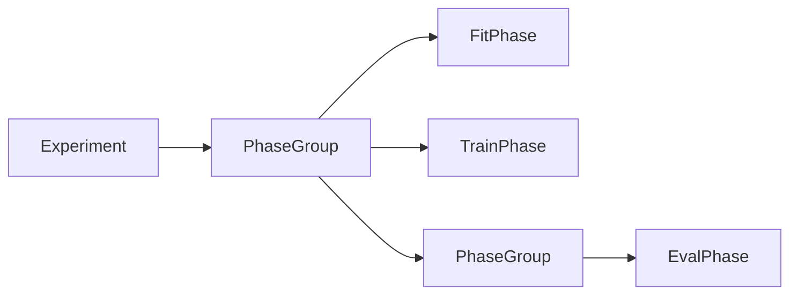

# Experiment Design

An ML workflow involves more than defining data and models. Someone needs to decide which phases run in what order, how results are tracked, when to save state, and how to respond to events like overfitting or metric degradation. In many frameworks, this orchestration logic lives in ad-hoc scripts—loops wrapped in try/catch blocks, with logging and checkpointing bolted on afterwards.

ModularML centralizes this orchestration in the `Experiment` class. An Experiment owns a registry of nodes (the `ExperimentContext`), an ordered execution plan of phases (a `PhaseGroup`), a callback system for responding to lifecycle events, and a history of past runs. It does not know the internal structure of any phase or model graph—it simply executes phases in sequence, fires callbacks at transition points, and records what happens.

This document explains how experiments are structured, how results flow through the system, how callbacks extend behavior, and how execution strategies like cross-validation compose with the experiment infrastructure. For how individual phases work internally, see [Training Phases](training_phases.md). For how the model graph executes during a phase, see [Model Graph Design](model_graph_design.md).

## The Experiment and its context

Every Experiment is backed by an `ExperimentContext`—a registry that tracks all nodes (FeatureSets, ModelNodes, ModelGraphs) by both UUID and human-readable label. When a node is created, it registers itself with the active context automatically. When a reference is resolved (e.g., a `FeatureSetReference` looking up its target), the context is what it resolves against.

The context uses a thread-local singleton pattern (`ContextVar`), so each experiment operates in its own namespace. This isolation is important for cross-validation (where each fold needs its own temporary context) and for concurrent experiments that should not interfere with each other.

A `RegistrationPolicy` controls how the context handles duplicate labels:

- **ERROR**: Raise an exception on duplicate labels (the safe default for scripts).
- **OVERWRITE**: Replace the existing node silently.
- **OVERWRITE_WARN**: Replace with a warning (the default for notebooks, where re-execution is common).
- **NO_REGISTER**: Skip registration entirely (used during deserialization).

The policy choice reflects a tension between safety and convenience. In a script, duplicate labels almost certainly indicate a bug. In a Jupyter notebook, re-running a cell that creates a FeatureSet is routine, and raising an error on each re-run would be disruptive. The policy makes this trade-off configurable rather than imposing a single behavior.

## Defining the execution plan

An Experiment's execution plan is a `PhaseGroup`—an ordered container of phases and nested sub-groups. Phases are added via `add_phase()` and executed in registration order when `experiment.run()` is called.

PhaseGroups can be nested for logical organization. A common pattern is grouping a TrainPhase and its associated EvalPhase into a sub-group, then repeating that group with different configurations. The experiment treats groups as opaque sequences—it iterates through them, fires callbacks at group boundaries, and records results with matching hierarchical structure.

The execution plan is deliberately declarative. Rather than writing imperative loops (`for epoch in range(...): train(); evaluate()`), the user declares the phase sequence and lets the experiment handle iteration, callback dispatch, and result collection. This declarative style makes execution plans serializable, inspectable, and reusable across different experiments.

## Executing phases: run vs. preview

The Experiment provides two modes for executing phases, distinguished by whether they mutate experiment state.

**`run()`** executes the full execution plan. It fires experiment-level callbacks, iterates through all phases, records results and timing metadata, and appends an `ExperimentRun` to the experiment's history. This is the standard execution path—it advances the experiment's state (model weights change, optimizers step, checkpoints are saved).

**`preview_phase()`** and **`preview_group()`** execute phases in a read-only mode. Before execution, the experiment saves its current state. After execution completes (or fails), the state is restored to its pre-execution snapshot. No history entry is recorded, and all checkpointing is suppressed.

Preview mode exists primarily for experimentation of an in-progress phase or phase group. It is convenient to check how a phase will be performed under its current configuration and inspect what results will be produced before adding it to the full Experiment execution plan.

The experiment also provides `run_phase()` and `run_group()` for executing individual phases or groups outside the full execution plan. These behave like `run()` (they mutate state and record history) but operate on a single phase or group rather than the entire plan.

## The callback system

Callbacks are the primary extension mechanism for both phases and experiments. They intercept lifecycle events, receive the current state as arguments, and can return results that feed into the experiment's tracking system.

### Two levels of callbacks

ModularML distinguishes between **phase-level callbacks** (`Callback`) and **experiment-level callbacks** (`ExperimentCallback`). They operate at different granularities and see different events:

**Phase-level callbacks** respond to events within a single phase's execution:

| Hook | When it fires | Available in |
|------|--------------|-------------|
| `on_phase_start` | Once, before any execution | All phases |
| `on_phase_end` | Once, after all execution | All phases |
| `on_epoch_start` | At the start of each epoch | TrainPhase |
| `on_epoch_end` | At the end of each epoch | TrainPhase |
| `on_batch_start` | Before each batch step | TrainPhase, EvalPhase |
| `on_batch_end` | After each batch step | TrainPhase, EvalPhase |
| `on_exception` | When an error occurs | All phases |

**Experiment-level callbacks** respond to broader lifecycle events:

| Hook | When it fires |
|------|--------------|
| `on_experiment_start` | Before any phases execute |
| `on_experiment_end` | After all phases complete |
| `on_phase_start` | Before each phase (at experiment level) |
| `on_phase_end` | After each phase (at experiment level) |
| `on_group_start` | Before a PhaseGroup executes |
| `on_group_end` | After a PhaseGroup completes |
| `on_exception` | When an unhandled error occurs |

The separation reflects different use cases. Phase callbacks handle concerns internal to a single training or evaluation run: metric computation, early stopping, logging per batch or epoch. Experiment callbacks handle cross-phase concerns: experiment-wide logging, resource management, inter-phase coordination.

### Callback safety mechanisms

Two safety mechanisms prevent callbacks from causing subtle bugs:

**Freeze-state preservation.** During phase callback execution, the model graph's freeze state is saved and restored via a context manager. This prevents a callback from accidentally unfreezing a node that was intentionally frozen—a mistake that could introduce unintended gradient flow and silently corrupt training.

**Recursion guard.** The experiment sets an `_in_callback` flag during callback execution. If a callback triggers an action that would normally fire another callback (e.g., the Evaluation callback runs an eval phase, which has its own callbacks), the nested invocations are suppressed. Without this guard, callbacks could trigger infinite recursion or fire in unexpected contexts. The recursion guard also suppresses experiment-level checkpointing during callback execution, preventing recursive state saves.

### Callback results and metrics

Callbacks can return `CallbackResult` objects, which are stored in the phase's results container. If a callback returns a `MetricResult` (a subclass of `CallbackResult` that carries a named scalar value), the value is automatically logged to the phase's `MetricStore`. This is how custom metrics flow into the same tracking system that training loss uses, making them available to other callbacks (like EarlyStopping) that monitor metrics by name.

### Built-in callbacks

Two built-in callbacks address the most common training patterns:

**Evaluation** runs an EvalPhase at configurable intervals during training (e.g., every N epochs, optionally at the start). It uses `experiment.preview_phase()` to execute the evaluation without mutating experiment state, then extracts results and logs them as callback outputs. Attached `EvaluationMetric` objects can compute summary values from the evaluation results—for example, `EvalLossMetric` computes loss on evaluation data and logs it to the MetricStore under a configurable name (typically `"val_loss"`).

**EarlyStopping** monitors a named metric (typically `"val_loss"`) at the end of each epoch. If the metric fails to improve for a configurable number of epochs (`patience`), it calls `phase.request_stop()`, which sets a flag that breaks the training epoch loop at the next natural boundary. Optionally, EarlyStopping can restore the model to its best-observed state—using either phase-level checkpointing or its own in-memory snapshots as a fallback.

Together, these two callbacks compose the standard early-stopping-with-validation pattern: Evaluation computes validation loss periodically, EarlyStopping monitors that metric, and training halts when overfitting is detected. This pattern is assembled from independent parts rather than baked into the training loop, which means each component can be replaced, reconfigured, or extended independently.

## Results and history

Every phase execution produces results. Every experiment run records those results alongside timing metadata and completion status. The results system is designed to be both structured (queryable via semantic axes) and hierarchical (mirroring the phase group structure).

### Phase results

Each phase type produces its own results subclass:

- **TrainResults** tracks outputs across multiple epochs and batches, with properties like `epoch_indices` and `n_epochs`.
- **EvalResults** tracks outputs across batches within a single evaluation pass, with convenience methods like `stacked_tensors()` (concatenates outputs across batches) and `aggregated_losses()`.
- **FitResults** captures the output of a single-pass fit operation.

All results share a common base (`PhaseResults`) that provides uniform access to execution contexts, losses, callback outputs, and metrics. The base class stores raw data and lazily computes queryable views on demand—calling `results.losses(node)` the first time builds a `LossDataSeries`, which is then cached for subsequent queries.

### AxisSeries: multi-dimensional indexed data

The results system's query interface is built on `AxisSeries`, a generic multi-axis indexed container. An AxisSeries stores values keyed by named coordinates—for example, a `LossDataSeries` keys loss records by `(epoch, batch, label)`, while a `TensorDataSeries` keys tensors by `(epoch, batch)`.

The axis structure enables flexible querying and aggregation:

- **`where(epoch=0)`** filters to all entries from epoch 0, returning a new AxisSeries with the epoch axis pinned.
- **`at(epoch=0, batch=3)`** retrieves a single entry at exact coordinates.
- **`select(epoch=0)`** returns a flat list of matching values.
- **`collapse(axis="batch", reducer="mean")`** reduces along an axis, producing a new AxisSeries with one fewer dimension.

Each AxisSeries subclass declares its supported reduction methods. `LossDataSeries` supports `"mean"`, `"sum"`, `"first"`, and `"last"`. `TensorDataSeries` supports `"first"`, `"last"`, and `"concat"` (backend-aware concatenation). This type-level constraint prevents invalid reductions—you cannot average tensors, but you can average scalar losses.

AxisSeries appears throughout the results system because the same pattern—multi-dimensional indexed data with semantic axes—applies to losses, tensors, metrics, batches, and callback results alike. Rather than building a custom query interface for each, the framework uses a single generic container with type-specific specializations. 

*Please note that this AxisSeries class, and broader result tracking/access is still an active focus area, and is subject to change in future releases.*

### MetricStore

The `MetricStore` is a flat namespace of named scalar metrics, each tagged with an epoch and optional batch index. Training loss is logged here automatically by the phase. Callbacks that return `MetricResult` objects have their values logged here too. The MetricStore is what EarlyStopping queries when it monitors `"val_loss"`—it doesn't need to know whether that metric came from a loss computation, an Evaluation callback, or a custom metric function.

This indirection—metrics identified by string name rather than by origin—is what makes callbacks composable. EarlyStopping can monitor any metric that any callback (or the training loop itself) logs, without coupling to the specific callback that produced it.

### ExperimentRun and history

Each call to `experiment.run()` (or `run_phase()` / `run_group()`) produces an `ExperimentRun` that is appended to the experiment's history. An ExperimentRun captures:

- **Timestamps**: `started_at` and `ended_at` for total duration.
- **Status**: `"completed"`, `"failed"`, or `"stopped"` (the latter when EarlyStopping or another mechanism halts execution).
- **Results**: A `PhaseGroupResults` container holding per-phase results, mirroring the execution plan's hierarchical structure.
- **Execution metadata**: A `PhaseGroupExecutionMeta` tree with per-phase timing and status information.

The history is accessible via `experiment.history` (all runs) and `experiment.last_run` (most recent). This enables post-hoc analysis of training dynamics across multiple runs—comparing convergence rates, identifying when early stopping triggered, or tracking how metrics evolved across hyperparameter sweeps.

### Hierarchical result structure

Results mirror the execution plan's structure. A `PhaseGroupResults` contains a dictionary of child results (either `PhaseResults` or nested `PhaseGroupResults`), keyed by label and ordered by execution. Convenience methods like `get_train_result()` and `get_eval_result()` auto-detect the target when there's only one result of that type, reducing boilerplate for common cases.

The hierarchy can be flattened via `flatten()` when a flat view is preferred, though this requires unique labels across all phases. The `CVResults` subclass (used by cross-validation) extends `PhaseGroupResults` with fold-specific accessors, demonstrating how the results hierarchy adapts to different execution patterns without requiring new query machinery.

## Checkpointing

ModularML provides checkpointing at two levels, each serving a different purpose.

### Phase-level checkpointing

A `TrainPhase` can attach a `Checkpointing` configuration that automatically saves model graph state at specified training lifecycle points. Valid hooks include `phase_start`, `phase_end`, `epoch_start`, `epoch_end`, `batch_start`, and `batch_end`. The `every_n` parameter controls frequency (e.g., save every 5 epochs), and `max_to_keep` limits the number of retained checkpoints.

Checkpoints can be stored in **memory** (fast, transient—lost when the process exits) or on **disk** (persistent, with configurable directory and name templates). Name templates support placeholders like `{phase}`, `{epoch}`, and `{batch}` for systematic checkpoint naming.

Phase-level checkpointing is primarily used for model restoration. EarlyStopping can use phase checkpoints to restore the model to its best epoch, and interrupted training runs can resume from the most recent checkpoint.

### Experiment-level checkpointing

Experiment-level checkpointing saves the full experiment state at experiment lifecycle boundaries: `experiment_start`, `experiment_end`, `phase_start`, `phase_end`, `group_start`, `group_end`. This captures broader state than phase checkpoints—not just model weights, but the full registered node graph.

When both levels are configured, the experiment propagates its checkpoint directory to child phases, ensuring a shared directory structure. During callback execution, experiment checkpointing is temporarily suppressed (via the `_checkpointing_disabled` flag) to prevent recursive state saves triggered by callbacks that execute phases.

The two levels complement each other: phase checkpoints provide fine-grained training snapshots (per-epoch, per-batch), while experiment checkpoints provide coarse-grained workflow snapshots (per-phase, per-group). A typical configuration might save experiment state at phase boundaries and model state every N epochs within training phases.

## Execution strategies: why cross-validation sits outside

Cross-validation, hyperparameter sweeps, and other multi-run workflows are implemented as **execution strategies** that sit external to the Experiment class rather than being built into it. This is a deliberate design choice.

The Experiment is responsible for executing a single run of a phase sequence: iterate phases, fire callbacks, record results. It does not know about folds, parameter grids, or repeated trials. Execution strategies orchestrate multiple experiment runs, each with different configurations, and aggregate results across runs.

This separation keeps the Experiment class focused. If cross-validation were built into the experiment, it would need to understand fold management, data partitioning, and result aggregation—concerns that are orthogonal to phase execution. By keeping these external, the Experiment remains a single-run orchestrator, and execution strategies compose with it from the outside.

### CrossValidation

The `CrossValidation` class orchestrates k-fold evaluation by reusing the existing experiment infrastructure:

1. **Fold generation.** For each bound FeatureSet (specified via `CVBinding` objects), generate k train/validation partitions using a `RandomSplitter`. Fold views are pre-computed before any execution begins.

2. **Per-fold execution.** For each fold, create a temporary experiment context (`ctx.temporary()`), replace the bound FeatureSets with fold-specific views, and run the configured phase template via `experiment.run_group()`. The temporary context ensures that fold-specific state does not leak into the original experiment.

3. **Result aggregation.** Collect per-fold results into a `CVResults` object (a subclass of `PhaseGroupResults`), which provides fold-specific accessors and a `collect()` method for extracting metrics across folds.

### CVBinding: configuring fold behavior

A `CVBinding` specifies how a FeatureSet participates in cross-validation:

- **Which FeatureSet** to fold (by label or reference).
- **Which existing splits** to pool as the data source for folding (e.g., combine `"train"` and `"val"` splits before re-partitioning).
- **Splitting strategy**: `group_by` for group-based splitting (ensuring all samples from a group land in the same fold) or `stratify_by` for stratified splitting (maintaining class balance across folds). These are mutually exclusive.
- **Split naming**: configurable labels for the train and validation partitions within each fold (defaulting to `"train"` and `"val"`).
- **Validation size**: optional explicit proportion for the validation partition (defaults to `1/n_folds`).

This configuration is declarative—the user specifies *what* should be folded and *how*, and the CrossValidation class handles the mechanics of view creation, context management, and result collection.

### CVResults: querying across folds

`CVResults` extends `PhaseGroupResults` with fold-aware accessors:

- **`get_fold(fold)`** retrieves the full results for a specific fold (by index or label).
- **`collect(extractor)`** applies a function to each fold's results and merges the outputs into an AxisSeries with a prepended `"fold"` axis. This enables compact cross-fold queries—for example, extracting validation loss per epoch per fold into a single indexed structure.
- **`epoch_losses()`** and **`validation_losses()`** provide shortcuts for the most common cross-fold queries.

The key insight is that anything that works in a single training run—custom callbacks, checkpointing, multi-phase workflows—works identically within cross-validation without modification. CrossValidation does not introduce new phase types or custom training loops. It simply runs the same experiment structure k times with different data partitions, collecting results along the way.

## Design principles

Several principles guide the experiment design:

**Phases are opaque to the experiment.** The experiment does not interpret phase contents. It consumes the `iter_execution()` generator, invokes the appropriate graph method for each yielded ExecutionContext, and records results. This allows different phase types (train, eval, fit) to coexist without special-casing.

**Callbacks compose, not configure.** Rather than providing a monolithic training loop with dozens of configuration flags (validate every N epochs, stop after M epochs without improvement, save best model, etc.), ModularML provides independent callback objects that compose the desired behavior. The Evaluation callback handles periodic validation. EarlyStopping handles patience-based halting. Each can be used independently or together, and users can write custom callbacks for behaviors the built-in ones don't cover.

**Results mirror structure.** The result hierarchy matches the execution plan hierarchy. A PhaseGroupResults contains child results in the same order and nesting as the PhaseGroup that produced them. This makes it straightforward to navigate results without needing to understand the execution engine's internals.

**Preview before commit.** The distinction between `run()` and `preview_phase()` makes it safe for callbacks to execute phases mid-training. The Evaluation callback can run a full evaluation pass without advancing experiment state—a pattern that would require manual state management in frameworks without preview mode.

**Execution strategies sit outside.** Cross-validation and other multi-run workflows compose with the experiment from the outside rather than being built into it. This keeps the experiment focused on single-run orchestration and makes execution strategies independently testable and extensible.
