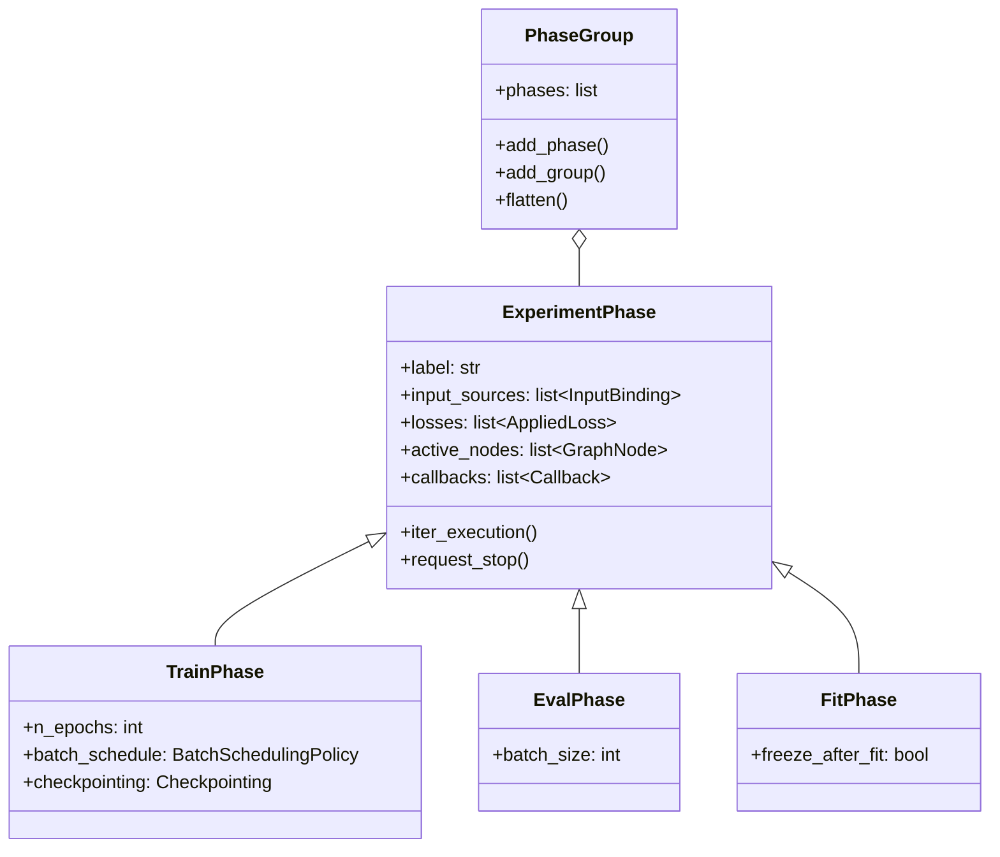

# Training Phases

In most ML frameworks, training is a monolithic loop: iterate over batches, compute loss, backpropagate, step the optimizer, repeat. ModularML breaks this apart. Training, evaluation, and fitting are each represented as distinct **phase** objects that declare *what* should happen (which data, which model, which loss) while delegating *how* it happens to the graph and the experiment orchestrator.

This separation makes it possible to compose training workflows from reusable parts: a TrainPhase paired with an EvalPhase and an EarlyStopping callback forms a standard training loop, but the same TrainPhase could equally be embedded in a cross-validation harness or chained with a FitPhase for a hybrid pipeline. The phases themselves are interchangeable; the experiment orchestrates their execution.

This document explains how phases work, what each phase type is responsible for, and why the design separates concerns the way it does. For the high-level architecture, see [Architecture Overview](architecture_overview.md). For how phases are orchestrated within experiments—including callbacks, results tracking, and cross-validation—see [Experiment Design](experiment_design.md).

## The phase hierarchy

All phases share a common base and specialize for their execution mode:



**ExperimentPhase** is the abstract base. It carries the elements common to all execution modes: a label, a set of input bindings (which data feeds which head node), optional losses, optional node restrictions, and phase-level callbacks. Its central method, `iter_execution()`, is a generator that yields `ExecutionContext` objects—one per batch step—representing the work the experiment should perform.

**TrainPhase** adds epoch iteration, batch scheduling for multi-sampler setups, and optional checkpointing. It is the workhorse for gradient-based optimization.

**EvalPhase** performs inference without gradient computation. It processes all samples in a split, optionally chunked into batches for memory efficiency, and collects outputs for downstream metric computation.

**FitPhase** handles closed-form models (e.g., scikit-learn regressors) that consume all training data in a single `fit()` call rather than iterating over mini-batches. It optionally freezes the fitted nodes afterward so they act as fixed feature extractors in subsequent phases.

**PhaseGroup** is a container that organizes phases into an ordered sequence, with support for nesting. An experiment's execution plan is itself a PhaseGroup, and groups can contain sub-groups for logical organization.

## Input bindings: connecting data to the graph

Before a phase can execute, it needs to know which data feeds which head node in the model graph. This is handled by **InputBinding** objects, each of which specifies:

- **Which head node** receives the data (by node ID).
- **Which FeatureSet** provides the data (via a `FeatureSetReference`).
- **Which split** of the FeatureSet to use (e.g., `"train"`, `"validation"`).
- **Which sampler** generates batches from the split (required for TrainPhase, optional for others).
- **Which stream** the sampler outputs to (for advanced multi-stream samplers).

This binding mechanism is what decouples phases from specific data sources. The same TrainPhase definition can be reused with different FeatureSets or different splits by changing the input bindings—the phase logic itself does not change. This is particularly important for cross-validation, where each fold uses the same phase structure but binds to different data partitions.

When multiple input bindings share the same sampler configuration and data source, the framework deduplicates sampler execution. The sampler materializes its batches once, and those batches are reused across all bindings that share the same configuration. This avoids redundant computation when multiple head nodes consume the same data stream.

## TrainPhase: the training lifecycle

A TrainPhase is the most complex phase type. Its `iter_execution()` method implements a nested loop—epochs containing batch steps—with callback hooks at every transition point.

### Epoch and batch iteration

The outer loop iterates over `n_epochs`. Within each epoch, the sampler(s) generate batches according to the configured batch scheduling policy. For each batch step, the phase yields an `ExecutionContext` to the experiment, which uses it to invoke the model graph's `train_step()` method.

The lifecycle within a single training phase looks like this:

```
Phase Start
│
├─ on_phase_start callbacks
│
├─ Epoch 0
│  ├─ on_epoch_start callbacks
│  ├─ Batch 0
│  │  ├─ on_batch_start callbacks
│  │  ├─ yield ExecutionContext → ModelGraph.train_step()
│  │  └─ on_batch_end callbacks (accumulate loss)
│  ├─ Batch 1
│  │  ├─ on_batch_start callbacks
│  │  ├─ yield ExecutionContext → ModelGraph.train_step()
│  │  └─ on_batch_end callbacks (accumulate loss)
│  ├─ ...
│  └─ on_epoch_end callbacks
│
├─ Epoch 1
│  └─ (same structure)
│
├─ ...
│
└─ on_phase_end callbacks
```

Each `ExecutionContext` carries the batch data for all input bindings, along with metadata (epoch index, batch index, phase label). After the graph processes each batch, losses are accumulated and logged to the phase's `PhaseResults` container, making them available to callbacks for monitoring, logging, or early stopping decisions.

### Batch scheduling policies

When a TrainPhase has multiple input bindings with different samplers—for example, two FeatureSets feeding different branches of the graph—the **batch scheduling policy** determines how batches from the different samplers are interleaved within each epoch.

Four policies are available:

**ZIP_STRICT** pairs batches from all samplers in lockstep, stopping when the shortest sampler is exhausted. If sampler A produces 100 batches and sampler B produces 80, only 80 steps are executed per epoch.

**ZIP_CYCLE** also pairs batches in lockstep, but cycles shorter samplers back to the beginning so all samplers run for the same number of steps. The shorter sampler's batches repeat until the longest sampler is exhausted.

**ALTERNATE_STRICT** interleaves batches in round-robin order (one from A, one from B, one from A, ...), stopping when any sampler runs out.

**ALTERNATE_CYCLE** interleaves in round-robin order, cycling shorter samplers to match the longest.

The choice depends on the training objective. Zip policies are natural when the model expects synchronized inputs from multiple sources (e.g., paired data). Alternate policies suit cases where different branches train on independent data streams and steps should alternate between them. The cycle variants prevent data imbalance when samplers have different sizes.

When alternate policies are used, batches from inactive samplers are replaced with fully masked `BatchView` objects (all indices set to -1). This signals to the graph that no real data is available for those bindings on that step, allowing selective execution of only the relevant branches. It also ensures that no lossses applied to masked data contribute to gradient updating.

### Checkpointing within training

A TrainPhase can optionally attach a `Checkpointing` configuration that automatically saves model state at specified points during training. Checkpoints can be saved:

- At phase start/end.
- At epoch start/end.
- At batch start/end.

The `every_n` parameter controls frequency (e.g., every 5 epochs), and `max_to_keep` limits the number of retained checkpoints. Checkpoints can be stored in memory (fast, transient) or on disk (persistent, larger overhead).

Phase-level checkpointing is distinct from experiment-level checkpointing. Phase checkpoints capture the model graph state at a specific training moment—useful for restoring the best model after early stopping. Experiment checkpoints capture broader state and are coordinated at the experiment orchestration level. Both systems coexist and share a directory structure when configured.

## EvalPhase: inference without training

An EvalPhase processes all samples in a *single* FeatureSetView without gradient computation. It is simpler than TrainPhase: no epochs, no optimizer steps, no batch scheduling. The phase iterates through the data in chunks (controlled by `batch_size`), yields an `ExecutionContext` per chunk, and collects the graph's outputs.

All input bindings in an EvalPhase must resolve to the same underlying FeatureSet and split. This constraint ensures that evaluation operates on a consistent dataset—mixing samples from different sources within a single evaluation pass would produce misleading metrics.

EvalPhase is typically not used directly in the experiment's phase sequence. Instead, it is embedded within an `Evaluation` callback attached to a TrainPhase, which runs the evaluation at configurable intervals (e.g., every N epochs). This pattern keeps training and evaluation logically separate while ensuring they execute in coordination.

## FitPhase: closed-form fitting

Not all models learn through iterative gradient descent. Scikit-learn estimators, for instance, consume all training data at once through their `fit(X, y)` method. FitPhase handles this pattern by yielding a single `ExecutionContext` containing the entire dataset, which the graph passes to the model's `fit_step()` method.

After fitting, FitPhase can optionally freeze the fitted nodes (`freeze_after_fit=True`, the default). This is the common pattern for hybrid pipelines where a scikit-learn preprocessing stage (PCA, a trained regressor used as a feature extractor) is fitted once and then held fixed while downstream neural network stages are trained iteratively via a subsequent TrainPhase.

The distinction between FitPhase and TrainPhase reflects a fundamental difference in learning paradigms. Iterative optimization (TrainPhase) processes data in mini-batches across multiple epochs, gradually adjusting parameters. Closed-form fitting (FitPhase) solves for optimal parameters in a single pass. Both are valid approaches for different model types, and ModularML treats them as first-class execution modes rather than forcing one into the other's interface.

## The loss system

Phases do not compute losses directly. Instead, they carry `AppliedLoss` objects that bind a loss function to specific model outputs and targets.

### Loss wrapping

The `Loss` class wraps any loss function—whether identified by name (`"mse"`), by class (`torch.nn.MSELoss`), by callable (`lambda y_pred, y_true: ...`), or by factory function—behind a uniform interface. This wrapping serves two purposes: it enables serialization (a string name or class path can be saved and reconstructed, while a raw lambda cannot) and it standardizes invocation across backends.

A Loss can be initialized in any of these modes and resolves to a callable at build time. The backend is either specified explicitly or inferred from the loss class. This flexibility means users can work with whatever loss interface they prefer—framework-native classes, custom functions, or string identifiers from the registry—without the phase needing to know which form was used.

### Applied losses: binding to the graph

An `AppliedLoss` takes a Loss and binds it to a specific location in the model graph:

- **Which node** produces the predictions (identified by node ID or reference).
- **Which inputs** the loss function receives (model outputs, targets, or arbitrary FeatureSet columns).
- **What weight** to apply to this loss when multiple losses are combined.

This binding is necessary because a model graph can have multiple output nodes, each requiring its own loss function. A multi-task model might have a classification head with cross-entropy loss and a regression head with MSE loss, each weighted differently. AppliedLoss captures these relationships declaratively, and the phase resolves them at execution time.

The input specification supports flexible argument routing. Loss inputs can reference model outputs (`"outputs.default"`), target columns (`"targets.default"`), or arbitrary data from FeatureSets. This generality enables custom losses that compare against external reference data, not just the model's own targets.

### Loss accumulation

During training, losses are accumulated per batch and per epoch. After each batch step, the phase logs the loss value to its internal `MetricStore` under the key `"train_loss"`. Callbacks can query this metric store to monitor training progress, and the Evaluation callback logs evaluation losses under `"val_loss"` (user-configurable) for comparison.

This metric accumulation is what enables EarlyStopping and other monitoring callbacks to make decisions based on training dynamics without needing direct access to the loss computation internals.

## Why separate phases from the training loop?

The phase abstraction may seem like unnecessary indirection for simple cases. A single model with MSE loss and an Adam optimizer could be trained in a few lines with a raw loop. The value of phases emerges as complexity grows:

**Reusability.** A TrainPhase configured with a specific sampler, loss, and callback set can be reused across experiments, cross-validation folds, or hyperparameter sweeps without modification.

**Composability.** Phases can be sequenced in any order within a PhaseGroup. A FitPhase followed by a TrainPhase creates a hybrid pipeline. Multiple TrainPhases with different active nodes enable progressive training strategies. The experiment orchestrator does not need to know the internal structure of any phase.

**Separation of concerns.** The phase defines *what* to train and *with what data*. The model graph defines *how* computation proceeds. The experiment defines *when* phases execute and *what to do* between them. Each concern can be modified independently.

**Testability.** Because phases are self-contained objects with declared inputs and outputs, they can be tested in isolation—instantiated with mock data and executed without a full experiment context.

This decomposition reflects a broader design philosophy in ModularML: prefer explicit, composable building blocks over implicit, monolithic workflows. The cost is more objects to configure for simple cases; the benefit is that complex cases do not require fighting the framework.

For how phases are assembled into experiments—with callbacks, results tracking, checkpointing, and cross-validation—see [Experiment Design](experiment_design.md).
