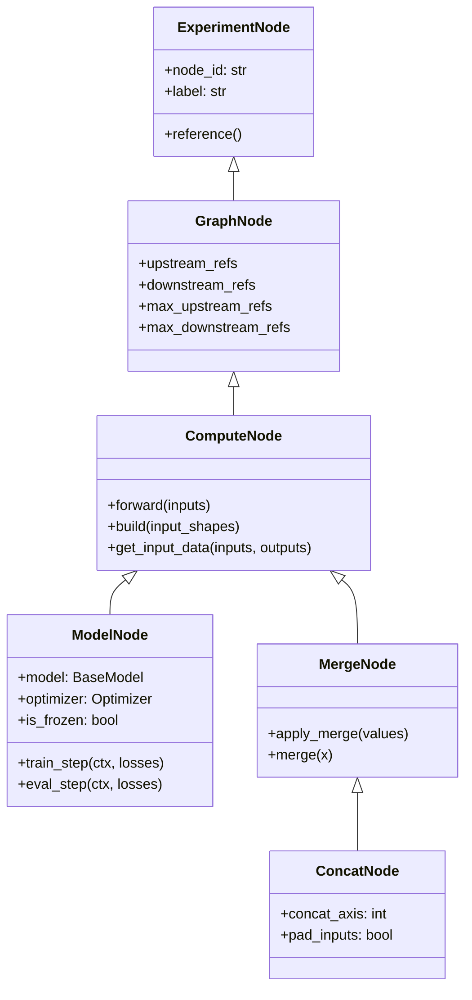

# Model Graph Design

Most ML frameworks treat a model as a single callable: data goes in, predictions come out. ModularML takes a different approach by representing model architectures as directed acyclic graphs (DAGs) of discrete nodes. This design makes it possible to compose multi-stage pipelines, mix backends, selectively freeze stages, and reason about data flow before any training begins.

This document explains the principles behind graph construction, how nodes connect and communicate, and why certain design choices were made. For a high-level overview of where graphs fit within the broader framework, see [Architecture Overview](architecture_overview.md). For how graphs interact with the training lifecycle, see [Training Phases](training_phases.md).

## Why graphs instead of sequential models?

A sequential model is a special case of a graph—a chain of nodes with no branching. Graphs generalize this to support architectures that sequential APIs cannot express cleanly:

- **Multi-input models** that consume data from separate FeatureSets (e.g., tabular features and time-series signals fused at a later stage).
- **Multi-stage pipelines** where an encoder feeds into both a classifier and a reconstruction decoder, each with its own loss.
- **Ensemble and fusion patterns** where multiple upstream models are merged before a final prediction head.
- **Selective freezing** where some stages are held fixed while others are trained, as in transfer learning or feature extraction.

A sequential API can approximate some of these patterns through workarounds, but the graph representation makes them first-class. Each node is an independent unit with its own identity, backend, optimizer, and freeze state. The graph manages the wiring and execution order, freeing the user from manually orchestrating data flow between stages.

## The node hierarchy

All graph nodes inherit from a common base and specialize through a focused hierarchy:

Each layer adds a specific responsibility:

**ExperimentNode** provides identity. Every node gets a UUID and a human-readable label, and registers itself with the active `ExperimentContext` so it can be found by reference later. This is the common base shared by all experiment-aware objects, including FeatureSets.

**GraphNode** adds topology. It maintains lists of upstream and downstream references and enforces connection limits. A `ModelNode` allows exactly one upstream connection (it consumes a single input), while a `MergeNode` allows unlimited upstream connections (it combines multiple inputs). These limits are structural guarantees, not runtime checks—they are enforced at construction time.

**ComputeNode** adds computation. It defines the `forward()` interface and the input resolution logic that determines where a node gets its data from. It also defines `build()`, which initializes the node's internal state based on inferred shapes.

**ModelNode** and **MergeNode** are the two concrete compute node types. A ModelNode wraps a single `BaseModel` instance and optionally an `Optimizer`. A MergeNode combines outputs from multiple upstream nodes using a merge strategy (currently concatenation via `ConcatNode`, with the architecture open to other strategies like averaging or attention-based fusion).

This hierarchy is deliberately shallow. Rather than deep inheritance chains, the design favors composition: a ModelNode *contains* a BaseModel rather than *being* one. This separation means the graph topology is independent of the ML backend—the same graph structure works whether the underlying models are PyTorch, TensorFlow, or scikit-learn.

## References: wiring without coupling

Nodes are connected through **references** rather than direct object pointers. A reference is an immutable, frozen dataclass that identifies a target node by label or ID and is resolved against an `ExperimentContext` at execution time.

This indirection exists for several practical reasons:

**Serialization.** A graph's structure can be saved as configuration and reconstructed later. Direct object references cannot survive serialization; symbolic references can.

**Cross-validation.** When running k-fold cross-validation, the same graph structure is applied to different data folds. References allow the graph to be defined once and bound to different FeatureSetViews at execution time, rather than rebuilding the graph for each fold.

**Construction order independence.** A ModelNode can reference a FeatureSet that hasn't been created yet, as long as it exists in the ExperimentContext by the time the reference is resolved. This flexibility is important when building complex experiments programmatically.

There are two primary reference types:

**FeatureSetReference** points to specific columns of a FeatureSet. It carries optional `features`, `targets`, and `tags` tuples that act as column selectors. When resolved, it produces a `FeatureSetView` filtered to the selected columns. If no selectors are specified, the full FeatureSet is used. This is how a ModelNode declares which data it consumes without holding a direct pointer to the data container.

**GraphNodeReference** (and its parent `ExperimentNodeReference`) points to another node in the graph. This is used for downstream wiring—when one ModelNode's output feeds into another ModelNode or a MergeNode. Resolution returns the target node itself, and the graph's forward pass uses this to look up cached outputs.

References prefer resolution by `node_id` (the UUID) when available, falling back to `node_label`. This means that label changes do not break existing wiring as long as IDs are preserved, which matters for serialization round-trips.

## How the graph executes

### Building: shape inference before training

Before any data flows through the graph, calling `ModelGraph.build()` performs shape inference. This step propagates tensor dimensions from the FeatureSet inputs through every node, ensuring that each node's model is initialized with the correct input and output shapes.

The algorithm traverses nodes in topological order:

1. For each head node (those whose upstream reference is a FeatureSet), the input shape is determined from the FeatureSet's column shapes.
2. For each subsequent node, the input shape comes from the cached output shape of its upstream node.
3. Each node's `build()` method initializes its internal model with the resolved shapes.
4. For MergeNodes, shape inference uses a dummy forward pass—synthetic tensors of the correct shape are passed through the merge operation to determine the output dimensions. This is necessary because merge operations (concatenation, padding) can produce output shapes that are not trivially derivable from input shapes alone.
5. Optimizers are constructed after all models are built, since they need access to model parameters.

Shape inference catches dimension mismatches early—before any training data is loaded—which is particularly valuable for multi-stage graphs where a mismatch between stages might otherwise surface as a cryptic runtime error deep in a training loop.

### Forward pass: topological traversal

`ModelGraph.forward()` executes the graph by iterating through nodes in topological order. For each node:

1. **Input resolution.** The node's `get_input_data()` method determines where its input comes from (within a given `Batch`). If the upstream reference is a FeatureSetReference, the input is looked up in the `inputs` dictionary (keyed by `(node_id, reference)` pairs). If the upstream reference is a GraphNodeReference, the input is retrieved from the `outputs` dictionary, which caches each node's output as it is computed.

2. **Computation.** The node's `forward()` method processes the input and produces an output `Batch`. For a ModelNode, this means passing the feature tensors through the wrapped model while preserving targets, tags, and UUIDs. For a MergeNode, this means applying the merge strategy across all upstream outputs.

3. **Output caching.** The result is stored in the `outputs` dictionary, keyed by node ID, making it available to downstream nodes.

The forward pass can optionally operate on a subset of nodes via the `active_nodes` parameter. When specified, the graph automatically includes all upstream dependencies of the active nodes, ensuring that every active node has its inputs available.

### Partial execution and active nodes

Not every forward pass needs to traverse the entire graph. The `active_nodes` parameter allows execution of a subgraph while still respecting dependencies. This is useful in scenarios like:

- Evaluating only a specific output branch of a multi-output graph.
- Running inference through an encoder without executing the decoder.
- Debugging a specific stage by isolating its execution.

The graph resolves the full dependency chain automatically—specifying a downstream node as active will include all upstream nodes it depends on.

## Training strategies

The graph supports two distinct training strategies, chosen based on whether a global optimizer is provided.

### Stage-wise training (no global optimizer)

When each ModelNode has its own optimizer (or no optimizer), training proceeds node by node in topological order. Each trainable, unfrozen node performs its own forward pass, loss computation, backward pass, and optimizer step independently. Frozen nodes and non-trainable nodes perform forward-only passes to propagate their outputs downstream.

This is the appropriate strategy when:
- Different stages require different optimizers or learning rates.
- Some stages are pretrained and frozen.
- Gradient flow between stages is not needed (e.g., the upstream stage's output is treated as a fixed input).

### Graph-wise training (global optimizer)

When a global optimizer is provided to the `ModelGraph`, training performs a single forward pass through the entire graph, computes all losses, and executes a single backward pass that propagates gradients across all unfrozen nodes. This enables end-to-end gradient flow, which is necessary when upstream and downstream stages need to co-adapt.

This strategy requires all trainable nodes to share the same backend (you cannot backpropagate through a PyTorch node into a TensorFlow node). The graph validates this constraint during `build()` and raises an error if backend-incompatible nodes would need to participate in the same gradient computation.

The choice between strategies reflects a real trade-off: stage-wise training is more flexible (mixed backends, independent optimization) but prevents gradient flow between stages. Graph-wise training enables end-to-end learning but constrains the graph to a single backend. ModularML makes this trade-off explicit rather than hiding it.

## Backend neutrality in practice

A ModelNode wraps a `BaseModel`, which is an abstract class with backend-specific subclasses: `TorchBaseModel`, `TensorflowBaseModel`, and `ScikitWrapper`. The graph topology itself is backend-agnostic—it operates on `Batch` objects and `SampleData` containers that can convert their contents between backends as needed.

When a node receives input from an upstream node using a different backend, the framework handles the conversion at the boundary. This means a graph *can* mix backends, though with the understanding that gradient flow stops at backend boundaries. In practice, most graphs use a single backend throughout, but the design does not enforce this—it simply makes the consequences explicit.

Each backend's model wrapper is responsible for its own forward/backward logic:
- **PyTorch** nodes use `torch.no_grad()` for evaluation and standard autograd for training.
- **TensorFlow** nodes use `tf.GradientTape` for training and direct calls for evaluation.
- **Scikit-learn** nodes use `fit()` / `partial_fit()` for training and `predict()` / `transform()` for evaluation.

This delegation means the graph does not need to understand backend internals—it simply calls the protocol methods (`train_step`, `eval_step`, `fit_step`) and lets each node handle its own execution semantics.

## Merge nodes and multi-input architectures

When a graph has multiple branches that need to converge, `MergeNode` provides the junction point. A MergeNode accepts unlimited upstream connections and combines their outputs into a single Batch for downstream consumption.

The current concrete implementation, `ConcatNode`, concatenates upstream outputs along a configurable axis. It handles several practical concerns:

**Dimension alignment.** When upstream outputs have different shapes on non-concatenation axes, `ConcatNode` can optionally pad inputs to align them. The padding mode and value are configurable.

**Domain-aware merging.** Features, targets, and tags can each use a different merge strategy. Features are always concatenated along the specified axis, but targets and tags support three strategies:
- **Axis-based concatenation** (same as features).
- **Aggregation** (first, last, or mean across upstream outputs).
- **Selection** (use the targets/tags from a specific upstream node, identified by reference).

This flexibility reflects the reality that in multi-input architectures, feature fusion and target handling often have different requirements. Two input branches might contribute features that should be concatenated, while the target labels should come from only one of them.

**Shape inference.** MergeNode determines its output shape by running a dummy forward pass with synthetic data matching the upstream shapes. This approach is more robust than algebraic shape computation, especially when padding or non-trivial merge strategies are involved.

## Freezing and selective training

Any ModelNode can be frozen (`node.freeze()`) or unfrozen (`node.unfreeze()`), which controls whether its parameters participate in gradient computation and optimizer steps. Frozen nodes still execute their forward pass—they produce outputs that downstream nodes can consume—but they do not update their weights.

This mechanism supports common workflows:
- **Transfer learning**: Freeze a pretrained encoder, train only the downstream head.
- **Feature extraction**: Freeze all stages, use the graph purely for inference.
- **Progressive unfreezing**: Gradually unfreeze stages during training (implementable via callbacks).

The graph's training methods respect freeze state automatically. During stage-wise training, frozen nodes fall through to evaluation-only execution. During graph-wise training, frozen nodes are excluded from the optimizer's parameter set, so the global backward pass does not compute their gradients.

## Graph manipulation

The `ModelGraph` provides methods for modifying graph structure after construction:

- `add_node()` adds a new node to the graph.
- `remove_node()` removes a node and re-routes its upstream connections to its downstream neighbors.
- `replace_node()` swaps a node while preserving all existing connections.
- `insert_node_between()` places a new node on an existing edge between two nodes.
- `insert_node_before()` and `insert_node_after()` insert a node relative to an existing one.

These operations re-validate the graph's connection integrity after each modification, ensuring the DAG invariant is maintained. They enable programmatic graph construction patterns where a base graph is modified dynamically—for example, inserting a normalization stage between an encoder and decoder, or replacing a model node with a different architecture while preserving the surrounding topology.

## Graph validation

The graph performs several validation passes during construction and building:

**DAG validation.** A depth-first search detects cycles. The graph must be acyclic; cyclic dependencies would create unresolvable execution orders.

**Reachability.** All nodes must be reachable from at least one head node. Unreachable nodes indicate wiring errors.

**Connection limits.** Each node type declares its maximum upstream and downstream connections. ModelNode allows exactly one upstream reference; MergeNode allows unlimited. Violations are caught at construction time.

**Backend compatibility.** When a global optimizer is specified, the graph verifies that all trainable nodes share a compatible backend. Mixed backends are permitted only under stage-wise training.

**Reference resolution.** All references must resolve to existing nodes in the ExperimentContext. Unresolvable references indicate missing dependencies.

These checks are designed to surface configuration errors early—at graph construction or build time—rather than during training, where debugging becomes significantly harder.

## Visualization

ModularML includes a visualization system that generates Mermaid diagrams from graph structures. Each node type has a distinct visual style:

- **FeatureSet nodes** appear in purple, showing the data sources feeding the graph.
- **ModelNode nodes** appear in blue (or light blue when frozen), representing computational stages.
- **MergeNode nodes** appear in gray, marking convergence points.
- **AppliedLoss nodes** appear in red, indicating where losses are computed.
- **Sampler nodes** appear in orange, showing data loading points.

Edge animations indicate data flow activity (static, slow, medium, or fast dash animations). FeatureSet nodes can optionally display their column names, shapes, split overlaps, and sample counts—useful for verifying that the graph is wired to the correct data.

These diagrams serve as both documentation and debugging tools. A visual representation of the graph makes it easier to verify that the topology matches the intended architecture, especially for complex multi-branch designs. It also makes collaboration significantly faster; one can just load a shared Experiment file, call `.visualize()`, and quickly ensure all data flow matches expectations and incorporates best data-bias prevention measures.

## Design principles summarized

Several principles guide the graph design:

**Topology is separate from computation.** The graph structure (which nodes exist, how they connect) is defined independently of what each node computes. This separation enables structural operations (add, remove, replace) without touching model internals.

**References over pointers.** Symbolic references decouple construction from resolution, enabling serialization, cross-validation, and construction-order independence.

**Explicit over implicit.** Backend differences, freeze states, and training strategies are all surfaced explicitly rather than hidden behind abstractions. The user knows whether gradients flow between stages and whether backends are compatible.

**Validate early.** Shape mismatches, backend conflicts, and wiring errors are caught at build time, not mid-training. This front-loads debugging effort to where it is cheapest.

**Composition over inheritance.** A ModelNode *contains* a BaseModel rather than extending it. A MergeNode defines a merge *strategy* rather than implementing concatenation directly. This keeps each component focused and replaceable.
